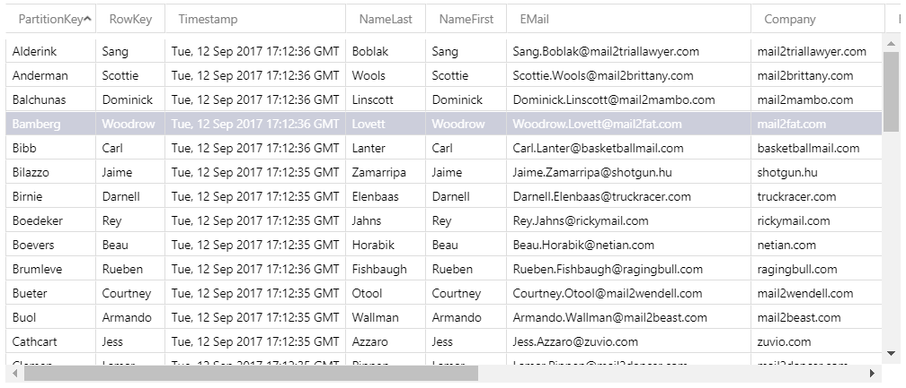

# Table Data Maker for Azure Cosmos DB in Table Mode

This project uses the project below to populate an Azure Cosmos DB with People Records.

Uses the NuGet Package - Data Generator from https://github.com/FermJacob/Faker.Data


## Build

Compile using VS 2017 or the equipment MSBUILD

## How to use

1. In your subscription create a Cosmod DB in Table Mode
2. Get the connection string
3. Run the generator with the arguments below

## Console Arguments

```txt
TableDataMaker.Console 1.0.0.0
Copyright c Blitzkrieg Software 2017

  -n, --Number_of_Records    (Default: 50) Number of Records

  -c, --Connection_String    Required. Connection String

  -h, --Help                 (Default: False) Help

  --help                     Display this help screen.
```

## Sample Execution

```bash
$ TableDataMaker.ConsoleApp.exe -n 50 -c "DefaultEndpointsProtocol=https;AccountName={Your database name};AccountKey={your secret key};TableEndpoint={end point}"
```
```txt

TableDataMaker.Console 1.0.0.0
0 -> Confrey|Kermit|Male|10/2/1983 12:00:00 AM|iwon.com|Kermit.Confrey@iwon.com|6139 Annapolis Lane North Meadow|Appt. 165|Pathfork|VA|71046
1 -> Wooleyhan|Lindsey|Male|10/25/1986 12:00:00 AM|lycos.es|Lindsey.Wooleyhan@lycos.es|6965 Dawn Drive Coves|Appt. 134|Dalton|NJ|41825
...
49 -> Lanter|Carl|Male|7/23/1966 12:00:00 AM|basketballmail.com|Carl.Lanter@basketballmail.com|343 Heathcote Lane Springs||Grand Lake|MS|56541
```

## what the data looks like in Azure




